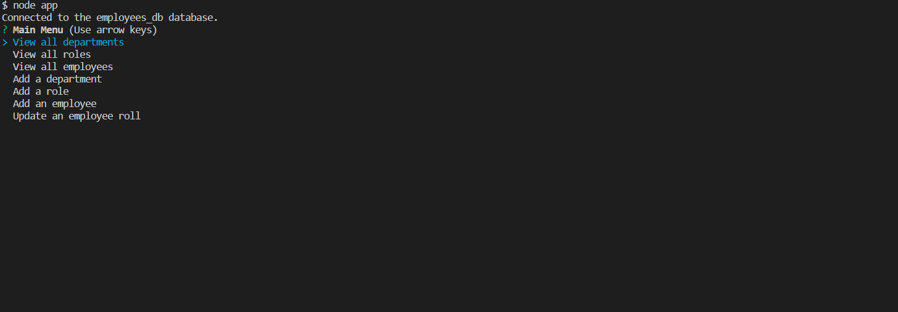

# Employee-Tracker

## Description

The Employee Tracker is a responsive console app that allows business owners to easily keep track of their employees and managers as well as their roles and departments.

## Installation

To install or deploy webpage type 'node app' in the console!

## Usage

Business owners can add, update and see their employee database through the console's main menu. Tables to visualize their employees and their roles and department will make managing different teams within their business.

## Credits

https://www.w3schools.com/sql/sql_select.asp
https://www.w3schools.com/nodejs/nodejs_mysql_select.asp
https://www.w3schools.com/sql/trymysql.asp?filename=trysql_func_mysql_concat2
https://www.w3schools.com/sql/sql_join_left.asp